1. czy do edycji strony dla Marysi, bedzie dobre keystatic? zeby ona mogła prawic beż dewelopera. Czy lepiej inny wdytor użyć?

2. Przeanalizuj proszę, która opcja jets lepsza dla strony:

OPCJA 1: STRONA GŁÓWNA: logo, menu główne, krótkie info co robimy  i od razu lista warsztatów, na które mozna sie zapisac

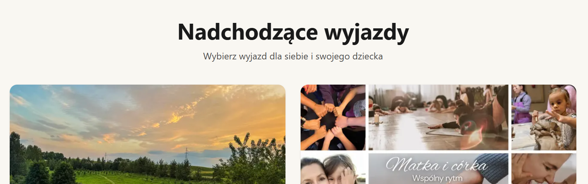

OPCJA 2: najpier idzie kalendaż, gdzie mozna po datach zobaczyć jakie są warsztaty, a dopiero potem lista aktywnych warsztatów.
- kalendaz pierwszy
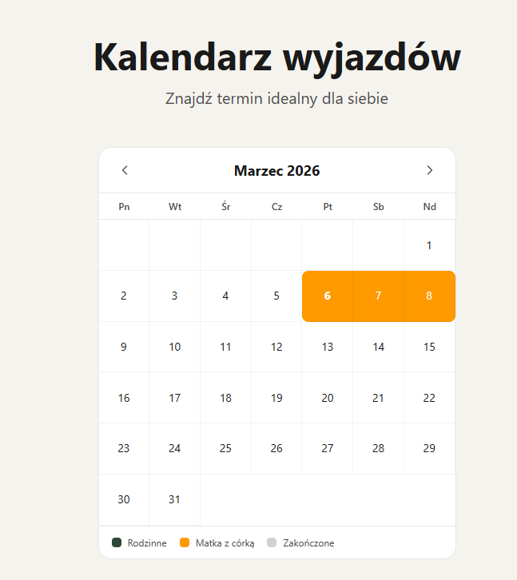

- lista warsztatów aktywnych
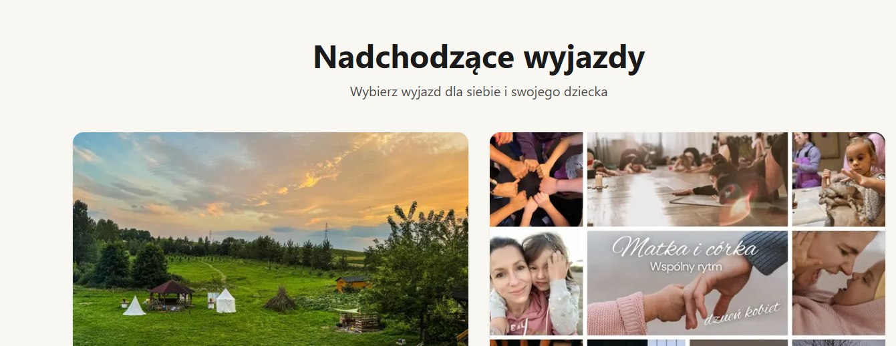

3. pod glownym meni dodać najpierw
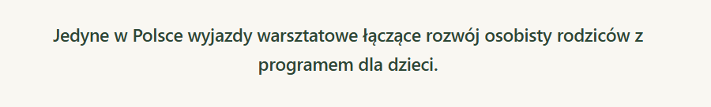

a dopiero potem juz lista warsztatów lub kalendarz.

4. ZMIENIĆ W MENU GŁÓWNE NA 
- o nas   
- warsztaty  
- matka i córka  
- single parents  
- tylko dla dorosłych  
- galeria  
- opinie klientów  
- kontakt 

ORAZ ZEBY BYŁY MOŻE DUZYMI LIETRAMI? czy to jest dobry pomysł?

5. Opis na belkę:  
- ZAMIAST "Wyjazd z Dziećmi"
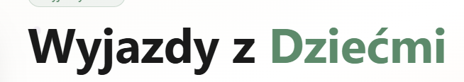

- TAK POWINNO BYĆ "Warsztaty wyjazdowe dla dorosłych i dzieci"

6. usunąć te belke 'Wyjazdy 2026'
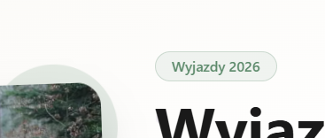

7. usunac ten przycisk 'Przejdz do treści'
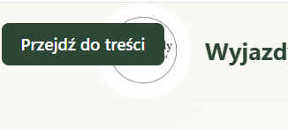

8. czy dobry pomysł robic aktualny warsztatów jeden pod drugim jak na tym przykładzie?
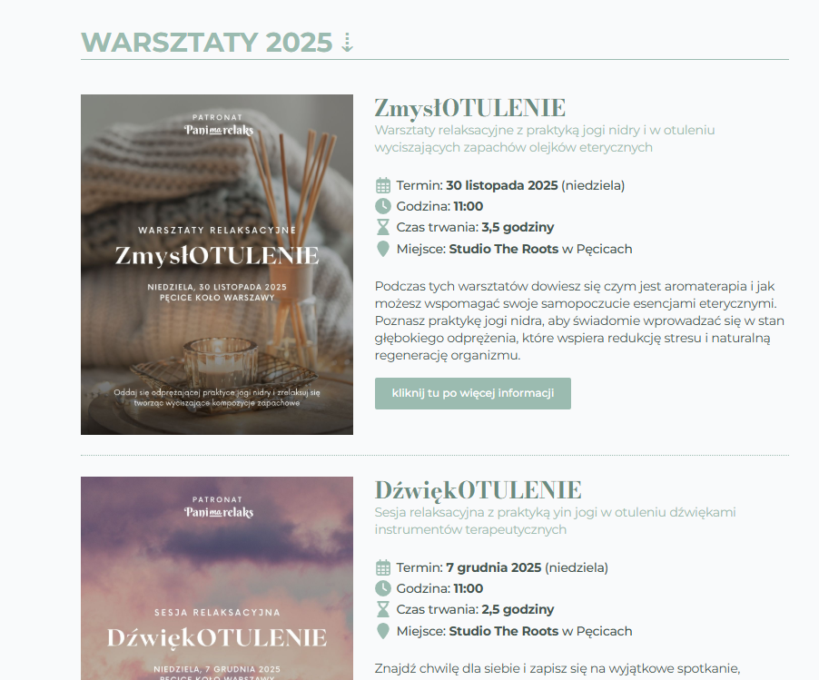

AKTULANIE TERAZ DWA W JEDNYM RZEDZIE
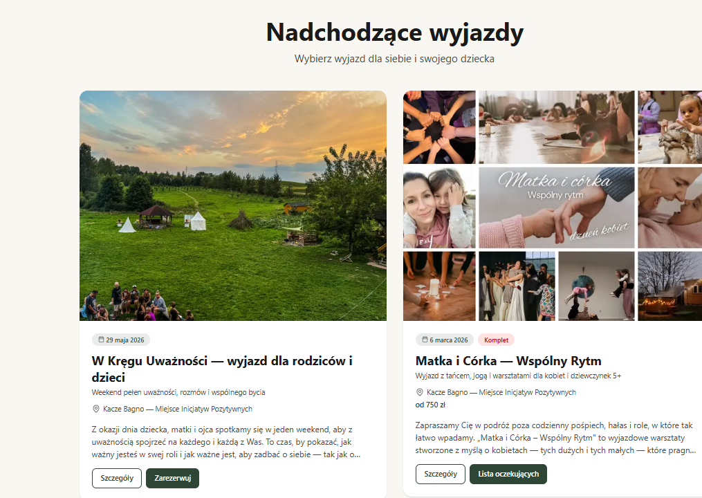

9. NA GLOWNEJ STRONIE - usunąc 'O mnie", ale od razu  "Poznaj tworczynie warsztatow", potem zdjecie i od razu Maria Kordalewska ..."
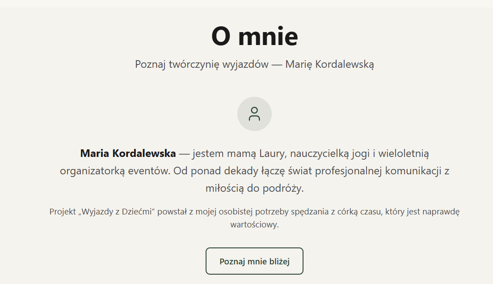

10. na głowna stronie - Usunąc 'Co mówią rodziny po naszych wyjazdach", a zostawić tylko 'opinie uczestnikow'
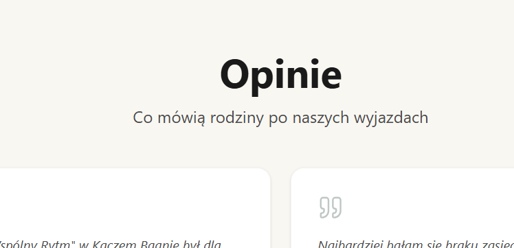

11. na głowna stronie - zmaienic z 'Minione wyjazdy' na ' zrealizowane warsztaty'
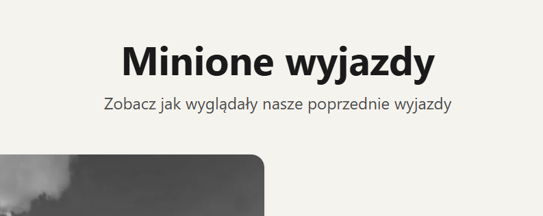

12. na głowna stronie - 'zrealizowane warsztaty' zamienic zdięcie na kolorowe
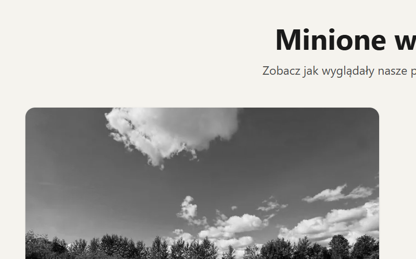

13. zamiast tego zdięcia bedzie dodany film lub slide show. czy to jest dobry pomysł? Cos co wzbudzi emocje i przyciagnie wzrok.
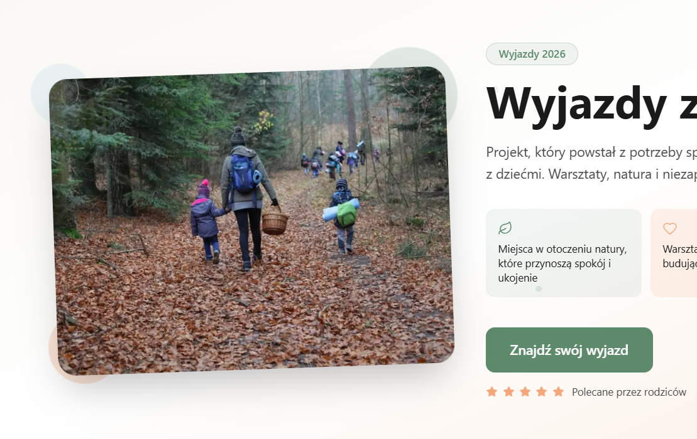